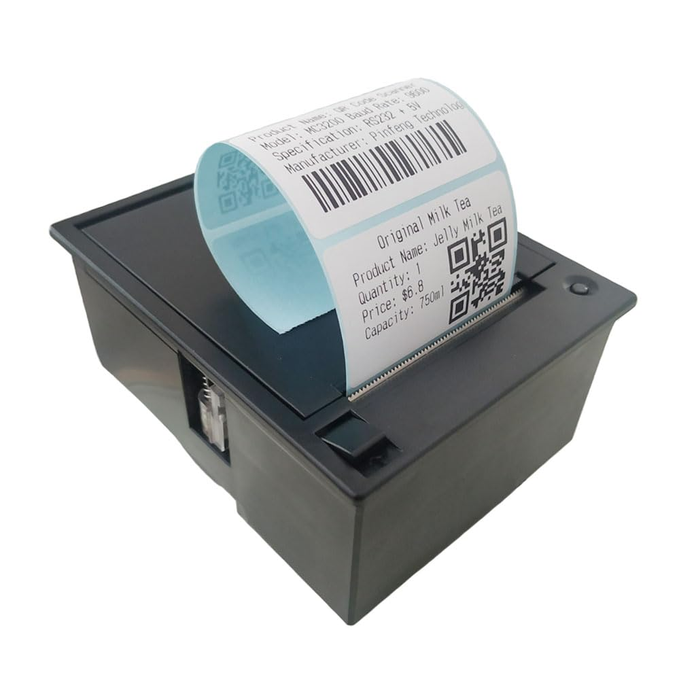

# Clase08

Jonathan e Isabela

### Definición fanzine

Nuestra definición se basa en la característica más importante del fanzine en nuestra opinión. Esta característica radica en lo político, ya que por su fácil elaboración se democratiza la producción de esta herramienta de masificación de información. 

### Definir objeto

hierbas desde la visión de Violeta Parra

### Procedimiento

impresora entrega mediante la interacción directa con esta una “boleta” con un catálogo de una investigación de hierbas medicinales utilizadas Violeta Parra, tanto en sus letras, arte, vida cotidiana.

Impresora de boletas Rs232 Thermal Printer 

### Base de datos

Relatos de vida de nuestras abuelas. Investigación de hierbas, usos y beneficios basada en prácticas de vida de Violeta.
